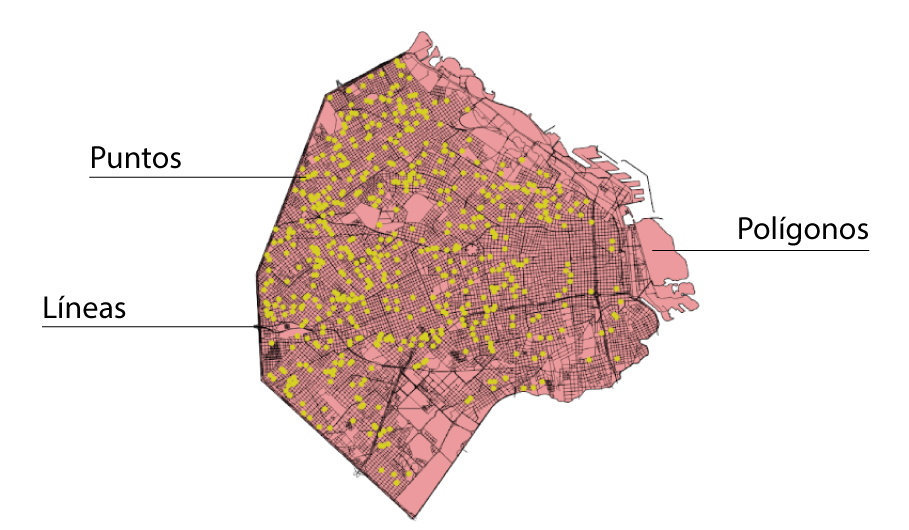

```{r setup, include=FALSE}
knitr::opts_chunk$set(echo = TRUE,message=FALSE, warning=FALSE)
```

# Intro datos geo

Hoy en día vemos mapas por todos lados. Si hay datos, entonces hay un mapa. De hecho se dice que el 80% de los datos tiene componente geo, o sea que casi todo puede ser ubicado en un mapa! Twitts, fotos de IG, pacientes, hospitales, comercios, noticias, etc, todo puede ser ubicado en un mapa.

El atributo que distingue a los datos georreferenciados es que representan ubicaciones exactas sobre la superficie de la Tierra. Es decir que cómo mínimo un dato georreferenciado tiene un par de coordenadas (X,Y) que representan la ubicación de un elemento en la superficie terrestre. Latitud y longitud es el **sistema de coordenadas de referencia** más usado hoy en día (CRS).

Otro concepto importante al momento de trabajar con datos geográficos es el de **proyección cartográfica**. Transformar una esfera (la tierra) en un plano (mapa) es todo un tema, no hay una única forma de hacerlo. La proyección cartográfica indica la serie de instrucciones que aplicamos para pasar a 2 dimensiones los distintos elementos de la esfera terrestre. Es por esto que hay muchísimas proyecciones cartográficas, y todas tienen ventajas y desventajas.

Al momento de manipular datos geográficos es sumamente importante saber con qué **sistema de coordenadas de referencia** y la **proyección cartográfica** fueron creados así podemos compararlos y trabajar con ellos adecuadamente.

En cuanto a tipos de datos geográficos encontramos 3:

* **Puntos:** Indica la posición exacta de un elemento (hospitales, reclamos, etc.). Está formado por sólo un par de coordenadas (X,Y)
* **Líneas:** Indica un recorrido (calles, ríos,etc.). Está formado por una secuencia de pares de coordenadas (X,Y)
* **Polígonos:** Indica el área / superficie de un elemento (barrio, área hospitalaria, etc.). Está formado por una secuencia de pares de coordenadas. 

<center>

</center>


Para manipular datos geográficos en R vamos a usar la librería **sf**, una de las más populares en R y con [muchísimas funciones disponibles](https://r-spatial.github.io/sf/reference/index.html). Al igual que con el resto de los paquetes de R lo instalamos usando *install.packages(sf)* y lo llamamos con *library(sf)*.


```{r Cargamos librerias, echo=TRUE, message=FALSE}
library(sf)
library(tidyverse)
```

# Datos geo

Conseguir datos geográficos es relativamente fácil hoy en día. Hay muchísimos fuentes de información que disponibilizan este tipo de datos:

* [**Instituto Geográfico Nacional**](https://www.ign.gob.ar/NuestrasActividades/InformacionGeoespacial/CapasSIG)
* [**BA Data**](http://data.buenosaires.gob.ar/)
* [**Datos Argentina**](http://datos.gob.ar/)

En cuanto a formatos de archivos geográficos principalmente encontraremos 3: *CSV*, *Shapefile (SHP)* y *GeoJson*.

En esta ocasión trabajaremos con un archivo en formato GeoJson que tiene los radios censales de la Ciudad de Buenos Aires, descargado del [portal de datos abiertos de la Ciudad](http://data.buenosaires.gob.ar/). Los radios son unidades geográficas que agrupan en promedio 300 viviendas en las ciudades y se usan para relevar información en el terreno. En los censos los radios son la unidad geográfica mínima en la que se publica información referida a población, hogares y viviendas.

```{r Cargando datos, echo=FALSE}

#Seteamos el directorio en el que vamos a estar trabajando
setwd("C:/Users/Marto/DataScience/clase-mapas-r-salud")

#Cargamos los datos
radios <- st_read('./data/caba_radios.geojson')
```

Con solo cargar el archivo ya R nos da información valiosa sobre este archivo:

* **`Simple feature collection with 3554 features and 8 fields`** ya nos indica que el archivo en cuestión tiene 3554 observaciones y 8 columnas.
* **`geometry type: MULTIPOLYGON`** indica que el archivo geografico tiene multiples poligonos (en este caso radios censales)
* **`dimension: XY`** indica que tiene 2 dimensiones (o sea que no hay una tercera dimensión "Z")
* **`bbox`** indica el *bounding box*, la caja que delimita y contiene a los datos en cuestión. Son los valores máximos y mínimos de las coordenadas.
* **`CRS: 4326`** indica el sistema de coordenadas de referencia en que están los datos. En este caso es el famoso WGS84. 

Al fin y al cabo un dato geográfico es como cualquier dataframe solo que tiene un campo con la información de la geometría. Por eso vamos a ver inspeccionar qué tiene el dataframe *radios*.

```{r Inspeccionando, echo=TRUE, message=FALSE}
head(radios)

summary(radios)
```

El dataset tiene un montón de información valiosa que podemos desplegar en un mapa.
Vamos con el primero.

#  De la tabla al mapa

Bueno, ya basta de tablas, vamos al mapa!
Vamos con una pregunta fácil. ¿Cómo se distribuye la población a lo largo y ancho de la Ciudad? ¿Donde hay más densidad poblacional?

Para hacerlo vamos a seguir utilzando la sintaxis de **ggplot()** pero indicando que ahora estamos trabajando con un dato geográfico, para eso vamos a usar **geom_sf()** como parámetro.

```{r echo=TRUE, message=FALSE}
ggplot() +
  geom_sf(data=radios)
```

Bien! Tal como podemos ver hay radios censales más grandes que otros, pero generalmente mantienen el mismo tamaño en este caso.
Vamos con un primer mapa coloreando los radios censales según el barrio.

```{r}
ggplot() + 
  geom_sf(data = radios, aes(fill = BARRIO))
```

Uuu! Tenemos muchísimas variables y no podemos ver el mapa!
Saquemos la referencia.

```{r}
ggplot() + 
  geom_sf(data = radios, aes(fill = BARRIO))+
  guides(fill=FALSE)
```


Ahora bien, intentemos encontrar algunos patrones haciendo un [mapa coroplético](https://es.wikipedia.org/wiki/Mapa_coropl%C3%A9tico) (*choropleth*)
Vamos con un simple mapa que muestre la cantidad de población por radio así vemos las zonas más pobladas de la Ciudad. Para eso vamos a agregar nuevos parámetros a nuestro ggplot() y de paso agregamos un título.

```{r}
ggplot() + 
  geom_sf(data = radios, aes(fill = POBLACION)) +
  labs(title = "Población por radio censal",
       subtitle = "Ciudad de Buenos Aires",
       fill = "Habitantes")
```

Ahí va mejor. Pero las líneas grises de los límites de los radios son algo molestas, vamos a sacarlas indicandole que no queremos ningún color poniendo **`color = NA`**. 
Como estamos trabajando con mapas a veces la referencia de los ejes X e Y con la latitud y la longitud no nos interesa mucho, para sacarlas podemos directamente aplicar un *theme* que haga el mapa más "limpio".

```{r}
ggplot() + 
  geom_sf(data = radios, aes(fill = POBLACION), color = NA) +
  labs(title = "Población por radio censal",
       subtitle = "Ciudad de Buenos Aires",
       fill = "Habitantes")+
  theme_void()
```

Va quedando pero tampoco podemos sacar una conclusión clara sobre la distribución de la población en la Ciudad. Vemos algunos radios grandes que tienen mucha población (al sur en Villa Lugano o en el centro el de Chacarita) y otros que tienen poca (Bosques de Palermo y el Autódromo).

Vamos a aprovechar que una columna indica la superficie del radio en km2 y otra la población y vamos a crear una nueva columna que indique la densidad poblacional de cada radio, su población por km2.
Seguimos aprovechando las bondades de tidyverse y usamos `mutate`.

Además vamos a cambiar la escala de cólores y usar **[viridis]**(https://cran.r-project.org/web/packages/viridis/vignettes/intro-to-viridis.html), también muy usada, y que nos permitirá destacar mejor los patrones escondidos en los datos. El parámetro `scale_fill_viridis_c()` nos va a dejar hacer esto.

```{r}
#Creamos nueva columna con densidad poblacional por barrio
radios <- radios %>% 
  mutate (densidad=POBLACION/AREA_KM2)

#Mapa según densidad de población usando viridis como escala de colores
ggplot() + 
  geom_sf(data = radios, aes(fill = densidad), color = NA) +
  scale_fill_viridis_c() +
  labs(title = "Densidad de población por radio censal",
       subtitle = "Ciudad Autónoma de Buenos Aires",
       fill = "hab/km2")+
  theme_void()
```

Ahora sí podemos ver algunos patrones. El corredor Cabildo-Santa Fe, Rivadavia y Pueyrredón emergen como zonas más densamente pobladas al igual que varios barrios vulnerables (31, 1-11-14, 21, Soldati).


# Coyuntura.. ¿¡o qué!? v2

Al igual que con cualquier dataframe podemos hacer agrupaciones de datos geográficos y "unir" polígonos según determinado criterio. Esto es sumamente útil cuando queremos pasar a trabajar con otras unidades geográficas.

Por ejemplo vamos a transformar este dataframe donde cada unidad es un radio censal a uno donde sean los barrios (o sea que pasaríamos de tener 3554 observaciones a 48). 
Para hacer esto usamos los conocidos `group_by()` y `summarise()`.

```{r}
barrios <- radios %>% 
    group_by(BARRIO) %>% 
    summarise(POBLACION = sum(POBLACION),
              VIVIENDAS = sum(VIVIENDAS),
              HOGARES = sum(HOGARES),
              HOGARES_NBI = sum(HOGARES_NBI),
              AREA_KM2 = sum(AREA_KM2))

head(barrios)
```

Y veamos cómo queda el nuevo mapa de barrios.

```{r}
ggplot() + 
  geom_sf(data = barrios, aes(fill = BARRIO), color = NA) +
  labs(title = "Barrios de la Ciudad de Buenos Aires")+
  theme_void()+
  guides(fill=FALSE)
```

Siguiendo con la coyuntura vamos a usar datos de covid a nivel barrio en la Ciudad de Buenos Aires que recopila [Sistema Mapache en su github](https://github.com/SistemasMapache/Covid19arData) a partir de los boletínes epidemiológicos semanales.

Vamos a leer el archivo como hacemos con cualquier dataframe *no-geográfico*.

```{r}
#Leemos el archivo
covid <- read_csv(file = "./data/covid-caba.csv")

summary(covid)
head(covid)
```

Vamos a intentar hacer un mapa que indique la cantidad de casos de covid por barrio. El problema es que propiamente dicho este dataframe no es geográfico ya que no tiene una columna con la geometría del barrio.  Pero tenemos la columna *localidad* que indica el barrio por lo que podemos aprovechar y hacer un `join` con nuestro dataframe geográfico de barrios.

```{r}
#Hacemos join
barrios <- left_join(barrios,covid,by = c("BARRIO" = "localidad"))

head(barrios)
```

Genial. Ahora tenemos un dataframe geográfico con cantidad de casos de covid por barrio. Vamos a hacer un nuevo mapa cloroplético con la tasa de covid cada 10.000 habitantes.

```{r}
barrios <- barrios %>% 
  mutate(tasa_covid=(casos/POBLACION)*10000)

ggplot(data=barrios) + 
  geom_sf(aes(fill =tasa_covid), color = NA) +
  scale_fill_viridis_c() +
  labs(title = "Casos covid por barrio cada 10000 habitantes",
       subtitle = "Ciudad Autónoma de Buenos Aires",
       fill = "Casos por cada 10000 habitantes")+
  theme_void()

```

Flores emerge claramente como el barrio con la tasa más alta de covid por cada 10.000 habitantes. Núñez y Villa Real al oeste también. La zona sur parece la menos afectada por ahora.

Si queremos salir de la perspectiva geográfica podemos hacer un gráfico de barras como con cualquier dataframe.

```{r}
ggplot(barrios) + 
  geom_bar(aes(x= reorder(BARRIO, tasa_covid), weight=tasa_covid)) +
  coord_flip() 
```

# Del polígono al punto

Por ahora estuvimos manejando un tipo de dato geográfico (polígonos) y haciendo un estilo de mapas (coropléticos), probemos usando datos que sean puntos y hagamos otros tipos de mapas.

Vamos a usar un dataset disponibilizado por el Ministerio de Salud del Gobierno Nacional que contiene la ubicación exacta todos los efectores de salud del país.

```{r}
#Cargamos los datos
salud <- read.csv("./data/refes-hospitales.csv", fileEncoding = 'UTF-8')

#Vemos la clase de objeto que es
class(salud)

head(salud)
summary(salud)
```

Lo cargamos como un dataframe normal *no-geográfico* pero al explorarlo vemos que tiene 2 columnas que sí precisan su ubicación exacta en la tierra, *LATITUD* y *LONGITUD*. Tenemos que hacerle entender a R que se trata de un dataframe geográfico, es fácil!

Primero filtramos y sólo nos quedamos con las observaciones que no son nulas ya que no podemos ubicar en un mapa objetos con latitud y longitud nulas.
Luego con `st_as_sf` convertimos el dataframe a un objeto geográfico indicandole dónde están los datos de las coordenadas y le indicamos el sistema de referencia de coordenadas.

```{r}
salud <- salud %>% 
  filter(!is.na(LONGITUD), !is.na(LATITUD)) %>% 
  st_as_sf(coords = c("LONGITUD", "LATITUD"), crs = 4326)

class(salud)
head(salud)
```

Como ven el objeto `salud` pasó de ser un *dataframe* a un *sf dataframe*, o sea un *dataframe geográfico*.
Y también podemos ver todas las características del objeto. El tipo de geometría es **punto**, tiene 2 dimensiones y el **CRS es 4326** el mismo que el de radios.

Ahora podemos mapear. Y lo hacemos igual que con el dataset de barrios y radios.

```{r}
ggplot()+
  geom_sf(data=salud)
```

No tenemos los límites de Argentina pero claramente los puntos de los efectores parecen distribuirse en todo el país, es decir que no se limitan a aquellos que se ubican en Buenos Aires.

A no desesperarse! Una de las bondades de los datos geográficos es que podemos hacer consultas espaciales. En este caso vamos a pedirle a R que **espacialmente nos filtre y seleccione** todos los efectores de salud que caen dentro de algún barrio de Buenos Aires. Para eso usamos `st_intersection` una de las funciones espaciales de la librería **sf**.

```{r}
#Nos quedamos solo con los efectores de salud que están dentro de barrios
salud_caba <- st_intersection(salud, barrios)
```

La consulta espacial dio como resultado un nuevo dataframe que nos indica que en la Ciudad de Buenos Aires hay 1154 efectores de salud.

Ahora sí, volvamos al mapa. Al igual que en cualquier gráfico de `ggplot()` podemos combinar capas. Vamos a agregar una capa con los barrios detrás para tener la referencia.

```{r}
ggplot()+
  geom_sf(data=barrios)+
  geom_sf(data=salud_caba)
```

A priori la distribución es parecida a la de densidad poblacional!

**Ejercicio**. Supongamos que querramos hacer un mapa que muestre la capacidad de respuesta del sistema de salud porteño, o sea sólo aquellos efectores que tengan internación. ¿Cómo lo hacemos?
Va tip, el campo `TIPOLOGÍA` nos va a ayudar.


Volvamos al mapa, pero profundizando el análisis. Vamos a pintar cada efector según la columna `ORIGEN_FINANCIAMIENTO` el cual indica si es *público* o *privado* para ver cómo es la distribución espacial.

```{r}
ggplot()+
  geom_sf(data=barrios)+
  geom_sf(data=salud_caba, aes(color=ORIGEN_FINANCIAMIENTO))
```

Para emprolijar podemos hacer *facetar* el mapa, al igual que con cualquier visualización de ggplot().

```{r}
ggplot()+
  geom_sf(data=barrios)+
  geom_sf(data=salud_caba, aes(color=ORIGEN_FINANCIAMIENTO))+
  facet_wrap(~ORIGEN_FINANCIAMIENTO)
```

Vamos con otro ejercicio ¿Cómo sería si quisieramos hacer un nuevo mapa choropleth con la cantidad de efectores de salud con internación por barrio?


# Más allá del choropleth

Hagamos otros tipos de mapas. Tener ubicaciones exactas, es decir objetos que son puntos, nos permiten hacer otros tipos de mapas como de *calor (heatmap)*, de *burbujas (bubblemap)* o de *densidad (densitymap)*, entre otros.

Dejemos de usar un rato la librería **sf** y vamos a considerar nuestro dataframe de efectores de salud en Buenos Aires como cualquier otro *no geográfico*. 

Antes con `st_as_coord()` habíamos transformado las columnas de *latitud* y *longitud* en una **geometry** ahora vamos a reestablecer esas columnas.


```{r}
#Reestablecemos las columnas lat y long con sus coordenadas
salud_caba$long <- st_coordinates(salud_caba)[,1]
salud_caba$lat <- st_coordinates(salud_caba)[,2]

#Le decimos a R que salud_caba_intern deja de ser un objeto geográfico
st_geometry(salud_caba) <- NULL

class(salud_caba)
```

Ahora *salud_caba* es un dataframe normal que tiene una columna *latitud* y otra *longitud* que expresan la posición de los elementos en la superficie terrestre. O sea que si hacemos un

Volvamos a **ggplot()** y hagamos un geom_point() tradicional.

```{r}
ggplot() +
  geom_point(data = salud_caba, aes(x = long, y = lat,color = ORIGEN_FINANCIAMIENTO))
```

Ven que queda igual que si fuera un objeto geográfico!
Aprovechemos nuevas funciones de ggplot() para hacer nuevos gráficos que "simulen" ser un mapa.
Un mapa de densidad de puntos que muestre las zonas con mayor concentración de efectores.

```{r}
ggplot() +
    geom_bin2d(data = salud_caba, aes(x = long, y = lat), bins = 50) +
    scale_fill_viridis_c()+
    labs(title = "Concentración de efectores de salud",
         fill = "Cantidad")
```

A todo esto siempre estuvimos trabajando con puntos y polígonos asumiendo que el fondo es Buenos Aires. Pero podemos agregar una capa base que tenga el mapa de Buenos Aires.

Para eso vamos a usar las librerías `ggmap` y `osmdata`, las cuales instalamos con el tradicional `install.packages("NOMBRE_LIBRERIA")` y agregamos con `library(NOMBRE_LIBRERIA)`. 
Con estas nuevas librería podemos agregar capas de fondo muy fácilmente.

Básicamente lo primero que tenemos que hacer es indicarle a R cuál es el limite, el *boundin gbox* del mapa que queremos descargarnos. Usamos la función `getbb` y le decimos que es "Ciudad Autónoma de Buenos Aires" ya que es el nombre oficial. Si estuvieramos haciendo un mapa de por ejemplo Rosario le indicaríamos "Rosario, Santa Fe, Argentina".

Luego, con `get_stamenmap` le indicamos especialmente que nos descargue el mapa, en este caso el tipo de mapa que nos estamos descargando es el `toner-background`, pero si quieren otro tipo pueden chequear la página de [Stamen Maps](http://maps.stamen.com/#terrain/12/37.7706/-122.3782).

Luego, en vez de usar ggplot() vamos a usar `ggmap()` pero no se preocupen la sintaxis sigue siendo la misma!

```{r}
library(ggmap)
library(osmdata)

#Indicamos cual es la ciudad de fondo que queremos
bbox <- getbb("Ciudad Autónoma de Buenos Aires,Argentina")

#Descargamos el mapa
CABA <- get_stamenmap(bbox = bbox,
                      maptype = "terrain",zoom=12)

# Mapa solo
ggmap(CABA)
```

Nos faltan los datos pero ahora sabemos con certeza que el fondo corresponde a Buenos Aires.

Si no nos gusta este mapa podemos probar con otro, por ejemplo con `toner-background`.

```{r}
#Descargamos el mapa
CABA <- get_stamenmap(bbox = bbox,
                      maptype = "toner-background",zoom=12)

ggmap(CABA)
```

Ahora si, agregemos los datos!

```{r}
ggmap(CABA)+
  geom_bin2d(data = salud_caba, aes(x = long, y = lat), bins = 50) +
    scale_fill_viridis_c()
```

Excelente!
Ahora probemos con un mapa que muestre la misma información pero simulando curvas de nivel.

```{r}

ggmap(CABA) +
  stat_density2d(data = salud_caba, aes(x = long, y = lat, fill=stat(level)),geom="polygon")+
  scale_fill_viridis_c()

```

Facetemos!

```{r}
ggmap(CABA) +
  stat_density2d(data = salud_caba, aes(x = long, y = lat, fill=stat(level)),geom="polygon")+
  scale_fill_viridis_c()+
  facet_wrap(~ORIGEN_FINANCIAMIENTO)
```

Al parecer los privados se concentran claramente en el centro, y de destaca también una concentración alta en la parte norte de la capital, mientras que los establecimientos públicos no tienen una concentración clara.

Por último hagamos un mapa de burbujas, donde el tamaño de cada punto que representa al efector está dado por la cantidad de casos de covid que tuvo el barrio en el que está.

```{r}
ggmap(CABA) +
  geom_point(data = filter(salud_caba,ORIGEN_FINANCIAMIENTO=="Público"), aes(x = long, y = lat, size=casos), color="red")
  
```


